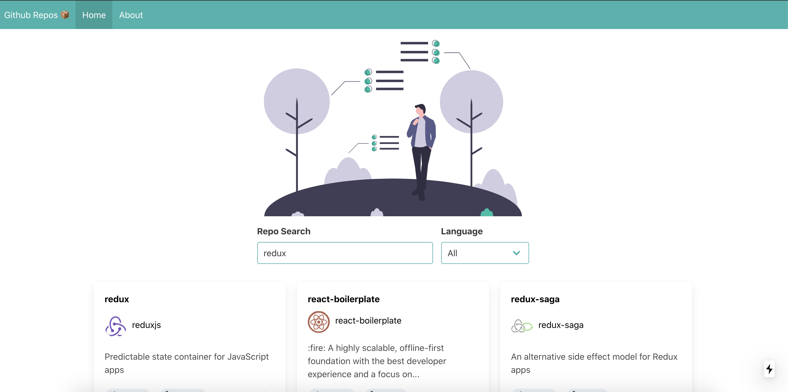

<div align="center" id="top">
  

&#xa0;

  <!-- <a href="https://githubrepos.netlify.app">Demo</a> -->
</div>

<h1 align="center">Github Repos</h1>

<p align="center">
  <a href="https://www.linkedin.com/in/andremorpanini/" target="_blank" rel="noopener noreferrer">
    
  </a>
  

  

  

  

</p>

<!-- Status -->

<!-- <h4 align="center">
	🚧  Github Repos 🚀 Under construction...  🚧
</h4>

<hr> -->

<p align="center">
  <a href="#dart-about">About</a> &#xa0; | &#xa0;
  <a href="#rocket-technologies">Technologies</a> &#xa0; | &#xa0;
  <a href="#white_check_mark-requirements">Requirements</a> &#xa0; | &#xa0;
  <a href="#checkered_flag-starting">Starting</a> &#xa0; | &#xa0;
  <a href="#memo-license">License</a> &#xa0; | &#xa0;
  <a href="https://github.com/Morpa" target="_blank">Author</a>
</p>

<br>

## :dart: About

Next app for study purposes

## :rocket: Technologies

The following tools were used in this project:

- [x] Next.js
- [x] TypeScript
- [x] Bulma
- [x] TypeScript
- [x] Sass

## :white_check_mark: Requirements

Before starting :checkered_flag:, you need to have [Git](https://git-scm.com) and [Node](https://nodejs.org/en/) installed.

## :checkered_flag: Starting

```bash
# Clone this project
$ git clone https://github.com/Morpa/github-repos

# Access
$ cd github-repos

# Install dependencies
$ yarn

# Run the project
$ yarn start

# The server will initialize in the <http://localhost:3000>
```

## :memo: License

This project is under license from MIT. For more details, see the [LICENSE](LICENSE.md) file.

Made with :heart: by <a href="https://github.com/Morpa" target="_blank">Morpa</a>

&#xa0;

<a href="#top">Back to top</a>
